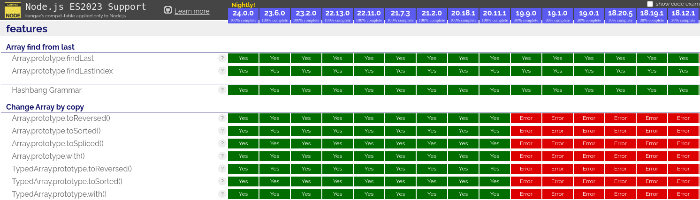
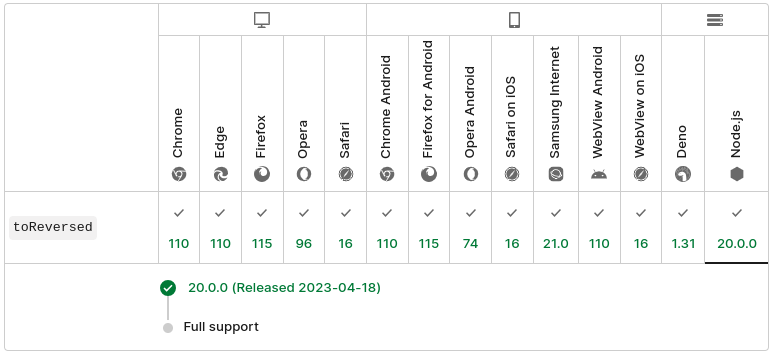

# TypeScript + node18

## Introduction

Following the TypeScript wiki at [Node Target Mapping page](https://github.com/microsoft/TypeScript/wiki/Node-Target-Mapping#node-18), we should be able to safely use the [base node18 tsconfig](https://github.com/tsconfig/bases/?tab=readme-ov-file#node-18-tsconfigjson).

More specifically, it says
> Note: All versions of Node 18 support all ES2023 runtime features, so lib can be safely set to ES2023.

## Issue

The trusted source (seems to be) [node.green](https://node.green/#ES2023) says the opposite (screenshot on 13/01/2025) :

Same for the [`mdn web docs`](https://developer.mozilla.org/en-US/docs/Web/JavaScript/Reference/Global_Objects/Array/toReversed#browser_compatibility) :


And it seems to be correct : this repository show a minimal example through the `Array.prototype.toReversed` method, using base node18 tsconfig.

### Usage

Be sure to use `node` version 18.
Tested with `node` v18.20.5.

1. Install dependencies with preferred package manager  
Example : `npm install`
2. Run `build` script -- compile TypeScript  
Example : `npm run build`
3. Run `test` script -- execute example demonstration  
Example : `npm run test`

### Expected result

On line 5 of compiled code, `const reversed = arr.toReversed();`, it should throw the following `TypeError` :
```
TypeError: arr.toReversed is not a function
    at Object.<anonymous> (/redacted/lib/index.js:5:22)
    at Module._compile (node:internal/modules/cjs/loader:1364:14)
    at Module._extensions..js (node:internal/modules/cjs/loader:1422:10)
    at Module.load (node:internal/modules/cjs/loader:1203:32)
    at Module._load (node:internal/modules/cjs/loader:1019:12)
    at Function.executeUserEntryPoint [as runMain] (node:internal/modules/run_main:128:12)
    at node:internal/main/run_main_module:28:49
```